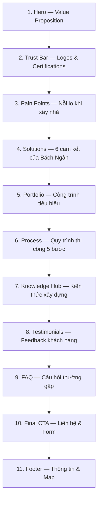

# PRD — Landing Page bachngancons.com

## Product Requirements Document  
**Công ty Cổ phần Giải pháp Cơ điện và Xây dựng Bách Ngân**  
**Version:** 1.0 | **Ngày:** 23/02/2026 | **Domain:** bachngancons.com

---

## 1. Tổng quan dự án (Project Overview)

### 1.1 Mục tiêu
Xây dựng Landing Page chuyên nghiệp, animated, đạt chất lượng "world-class" cho **Bách Ngân Construction** — công ty chuyên cung cấp giải pháp cơ điện và xây dựng trọn gói tại Hà Nội. Landing page phải:

- **Xây dựng uy tín** thương hiệu online cho lĩnh vực xây dựng dân dụng – công nghiệp
- **Thu hút leads** (khách hàng tiềm năng) thông qua form liên hệ / Zalo / Hotline
- **Thể hiện năng lực** qua portfolio công trình thực tế
- **Giáo dục khách hàng** qua nội dung chuyên môn (kiến thức xây dựng)

### 1.2 Target Audience
| Nhóm | Đặc điểm | Nhu cầu chính |
|------|----------|---------------|
| Chủ nhà cá nhân | 30-50 tuổi, Hà Nội & miền Bắc | Xây nhà mới / cải tạo trọn gói |
| Chủ đầu tư nhỏ | Nhà phố, biệt thự 2-5 tầng | Thi công chìa khóa trao tay |
| Doanh nghiệp | Quán cafe, showroom, văn phòng | Thi công nội thất thương mại |
| Đối tác B2B | Các nhà thầu phụ, cung cấp VT | Hợp tác dự án |

### 1.3 Tech Stack & Tools
| Công cụ | Mục đích |
|---------|----------|
| **Vite + React** | Framework chính |
| **Tailwind CSS v4** | Styling system |
| **Framer Motion** | Scroll animations & micro-interactions |
| **Vercel** | Hosting & deployment |
| **Google Fonts** | Playfair Display (heading) + Inter (body) |

---

## 2. Bước 1 — Chốt Offer (Value Proposition)

### 2.1 Landing này bán gì?
**Dịch vụ thiết kế - thi công xây dựng trọn gói, chìa khóa trao tay** cho nhà ở dân dụng và công trình thương mại tại Hà Nội & miền Bắc.

### 2.2 Cho ai?
Chủ nhà & chủ đầu tư đang tìm **đơn vị thi công uy tín, minh bạch chi phí, đảm bảo tiến độ**.

### 2.3 Hành động chính (CTA)?
**Liên hệ nhận báo giá miễn phí** → qua form / Zalo / Hotline.

### 2.4 Copy chính

| Element | Nội dung |
|---------|----------|
| **Headline** | Kiến tạo tổ ấm — Chìa khóa trao tay |
| **Subheadline** | Thiết kế & thi công trọn gói nhà ở, nội thất với sự minh bạch tuyệt đối. Bảo hành 5 năm, kỹ sư giám sát trực tiếp, báo cáo tiến độ hàng ngày. |
| **CTA chính** | Nhận báo giá miễn phí |
| **CTA phụ** | Xem công trình đã thực hiện |

---

## 3. Bước 2 — Reference & Visual Direction

### 3.1 Design Direction
Aesthetic: **Cinematic Dark Industrial** — đã được thiết lập trong design tokens:

```json
{
  "primary": "#0C0A09",     // Nền tối sang trọng
  "accent": "#EAB308",      // Amber/vàng — liên tưởng đến ánh sáng công trình
  "textMain": "#F5F5F4",    // Text sáng trên nền tối
  "textMuted": "#A8A29E"    // Text phụ
}
```

### 3.2 Nguồn cảm hứng
| Loại | Nguồn | Ghi chú |
|------|-------|---------|
| Hero sections | [supahero.io](https://supahero.io) | Layout hero đầy đặn, CTA rõ |
| Bento grids | [bentogrids.com](https://bentogrids.com) | Feature blocks dạng grid |
| CTA patterns | [cta.gallery](https://cta.gallery) | Mẫu CTA chuyển đổi cao |
| Industrial UI | [zwart.tech](https://zwart.tech) | Phong cách công nghiệp tối |
| Background FX | [unicorn.studio](https://unicorn.studio) | Particle & ambient effects |

### 3.3 Mood Keywords
`Industrial` · `Trust` · `Precision` · `Transparency` · `Warmth` · `Professional`

---

## 4. Bước 3 — Hero Section

### 4.1 Layout Structure
```
┌──────────────────────────────────────────────────────┐
│  [Logo]                         [Nav Links]  [CTA]   │
├──────────────────────────────────────────────────────┤
│                                                      │
│   KIẾN TẠO TỔ ẤM                                    │
│   CHÌA KHÓA TRAO TAY                                │
│                                                      │
│   Thiết kế & thi công trọn gói...                    │
│                                                      │
│   [🟡 Nhận báo giá miễn phí]  [Xem công trình →]    │
│                                                      │
│   ┌─────┐ ┌─────┐ ┌─────┐ ┌─────┐                   │
│   │400m²│ │ 50+ │ │  5  │ │ 10+ │                    │
│   │diện │ │công │ │ năm │ │ năm │                    │
│   │tích │ │trình│ │ BH  │ │ KN  │                    │
│   └─────┘ └─────┘ └─────┘ └─────┘                   │
│                                                      │
│   [Ambient gradient motion background]               │
└──────────────────────────────────────────────────────┘
```

### 4.2 Checklist "3 câu hỏi trong 3 giây"
- ✅ **Đây là gì?** → "Thiết kế & Thi công trọn gói" (subheadline)
- ✅ **Có lợi gì cho tôi?** → "Minh bạch chi phí, bảo hành 5 năm, giám sát hàng ngày"
- ✅ **Tôi cần bấm gì?** → Button CTA amber nổi bật

### 4.3 Social Proof Metrics (trích từ nội dung thực)
| Metric | Value | Source |
|--------|-------|--------|
| Diện tích đã thi công | 400m²+ | Dự án Tây Tựu |
| Dự án hoàn thành | 50+ | Portfolio tổng hợp |
| Bảo hành | 5 năm | Cam kết công ty |
| Năm kinh nghiệm | 10+ | Profile công ty |

---

## 5. Bước 4 — Icons & Visual Language

### 5.1 Icon System
- **Style:** Lucide Icons (consistent, modern, line-style)
- **Sizes:** 16px (sm) · 24px (md) · 32px (lg) · 48px (xl)
- **Stroke:** 1.5px (regular)
- **Color:** Inherit from parent text or accent amber

### 5.2 Visual Rules
| Rule | Specification |
|------|---------------|
| Border radius | `8px` (cards) · `12px` (large containers) · `9999px` (pills) |
| Shadow system | Single shadow set: `0 4px 24px rgba(0,0,0,0.3)` |
| Image treatment | Grayscale filter + amber overlay on hover |
| Dividers | `1px solid #44403C` (border token) |

---

## 6. Bước 5 — Typography

### 6.1 Font Pairing
| Role | Font | Cỡ chữ | Ghi chú |
|------|------|---------|---------|
| Heading | **Playfair Display** | H1: 48-64px / H2: 32-40px | Serif sang trọng, hỗ trợ Vietnamese |
| Body | **Inter** | 16-18px | Sans-serif dễ đọc, hỗ trợ Vietnamese |
| Hero | Playfair Display | `clamp(4rem, 12vw, 10rem)` | Responsive hero text |

### 6.2 Scale & Spacing
```css
/* Typography Scale */
--font-hero:    clamp(4rem, 12vw, 10rem);
--font-h1:      2.5rem;
--font-h2:      2rem;
--font-h3:      1.75rem;
--font-body:    1rem;
--font-small:   0.875rem;

/* Line Height */
--lh-heading:   1.2;
--lh-body:      1.6;

/* Letter Spacing */
--ls-hero:      -0.04em;
--ls-heading:   -0.02em;
```

---

## 7. Bước 6 — Animations & Motion Design

### 7.1 Prompt Animations

| Effect | Mô tả | Timing |
|--------|--------|--------|
| **Hero beam** | Animated beam crossing hero background, low opacity | Loop 8s |
| **Logo marquee** | Partner/certification logos infinite scroll | Smooth, pause on hover |
| **Card hover** | Lift 6px, increase shadow, scale 1.02 | 180ms ease-out |
| **Ambient gradient** | Soft gradient motion on hero background | Continuous, subtle |
| **Scroll reveal** | Sections fade-in + slide-up on scroll | 500ms, stagger 100ms |
| **Counter animation** | Metrics count up from 0 when in viewport | 2s duration |
| **Blueprint lines** | SVG construction blueprint lines drawing on scroll | Scroll-driven |

### 7.2 Quy tắc vàng
> Animation phải **hỗ trợ hierarchy**, không được "làm ồn". Mỗi animation phải có mục đích rõ ràng — hướng mắt người đọc đến CTA hoặc tạo cảm giác chuyên nghiệp.

### 7.3 Performance Budget
- Total animation weight: < 50KB JS
- Sử dụng `will-change` và `transform` thay vì `top/left`
- Respect `prefers-reduced-motion`

---

## 8. Bước 7 — Page Sections (Bento Grid Layout)

### 8.1 Section Flow



---

### 8.2 Chi tiết từng Section

#### Section 1: Hero
*(Đã mô tả ở Bước 3)*

---

#### Section 2: Trust Bar (Marquee)
Logo đối tác + chứng chỉ ISO + con số thống kê, marquee infinite scroll.

---

#### Section 3: Pain Points — "Nỗi lo khi xây nhà"
*Source: Bài viết "Báo giá xây nhà trọn gói"*

Bento grid 3 cột, mỗi card một pain point:

| # | Pain Point | Icon |
|---|-----------|------|
| 1 | Báo giá mập mờ, chi phí ẩn | 💰 |
| 2 | Vật tư bị thay đổi kém chất lượng | 🧱 |
| 3 | Phát sinh chi phí không kiểm soát | 📈 |
| 4 | Tiến độ trễ, không ai giám sát | ⏰ |
| 5 | Không có bảo hành đàng hoàng | 🛡️ |
| 6 | Thi công thiếu chuyên nghiệp | ⚠️ |

---

#### Section 4: Solutions — "6 cam kết của Bách Ngân"
*Source: Recurring commitments across all posts*

Bento grid layout, mỗi cam kết là một card với icon + mô tả:

| # | Cam kết | Chi tiết |
|---|--------|----------|
| 1 | ✅ Bảo hành 5 năm | Hệ thống bảo hành toàn diện |
| 2 | ✅ Miễn phí tư vấn thiết kế | Tư vấn công năng không mất phí |
| 3 | ✅ Hồ sơ thủ tục đầy đủ | Đăng ký thi công, nghiệm thu |
| 4 | ✅ Hỗ trợ vay vốn | Thủ tục vay ngân sách nhà nước |
| 5 | ✅ Cam kết vật tư | Đúng chủng loại đã thỏa thuận |
| 6 | ✅ Giám sát hàng ngày | KS giám sát trực tiếp, báo cáo online |

---

#### Section 5: Portfolio — "Công trình tiêu biểu"
*Source: Dự án thực tế từ content*

Carousel/Gallery hiển thị các dự án:

| Dự án | Địa chỉ | Diện tích | Hạng mục |
|-------|---------|-----------|----------|
| Nhà phố Tây Tựu | Hà Nội | 400m² | Xây mới trọn gói |
| Nội thất nhà ở | Ngô Quyền, Hải Phòng | — | Nội thất toàn bộ |
| Cafe Phúc | — | — | Thi công thương mại |

Mỗi dự án: ảnh before/after (nếu có), thông tin, CTA "Xem chi tiết".

---

#### Section 6: Process — "Quy trình thi công minh bạch"
*Source: Bài "Báo giá xây nhà trọn gói" — thanh toán theo giai đoạn*

Timeline dọc hoặc stepper ngang, 5 bước:

```
[1] Khảo sát & Tư vấn miễn phí
         ↓
[2] Thiết kế & Báo giá chi tiết
         ↓
[3] Ký hợp đồng & Thanh toán theo giai đoạn
         ↓
[4] Thi công — Giám sát — Báo cáo hàng ngày
         ↓
[5] Nghiệm thu & Bàn giao — Bảo hành 5 năm
```

Highlight: "Làm tới đâu, trả tiền tới đó" — mọi phát sinh phải ký duyệt.

---

#### Section 7: Knowledge Hub — "Kiến thức xây dựng"
*Source: Bài viết kỹ thuật (cắt đầu cọc, sỏi vs đá dăm, chọn móng nhà)*

Grid 3 bài viết tiêu biểu:

| Bài | Chủ đề | Category |
|-----|--------|----------|
| 1 | Hướng dẫn cắt đầu cọc bê tông 150×150 | Kỹ thuật thi công |
| 2 | Sỏi tự nhiên vs Đá nghiền: chọn đúng cho bê tông | Vật liệu xây dựng |
| 3 | 4 loại móng phổ biến: chọn đúng cho đất nhà bạn | Kiến thức nền móng |

Mỗi card: thumbnail, tiêu đề, trích đoạn, nút "Đọc thêm".

---

#### Section 8: Testimonials
Slider/Carousel feedback khách hàng, trích từ nội dung thực:

> *"Mỗi không gian sống là một câu chuyện. Và chúng tôi đã cùng gia chủ viết nên câu chuyện ấy bằng sự tỉ mỉ trong từng chi tiết."*

---

#### Section 9: FAQ
Accordion UI, các câu hỏi thường gặp:

| # | Câu hỏi |
|---|---------|
| 1 | Chi phí xây nhà trọn gói được tính như thế nào? |
| 2 | Thời gian thi công trung bình là bao lâu? |
| 3 | Bách Ngân thi công ở khu vực nào? |
| 4 | Quy trình thanh toán như thế nào? |
| 5 | Bảo hành công trình bao gồm những gì? |
| 6 | Nếu muốn thay đổi thiết kế giữa chừng thì sao? |

---

#### Section 10: Final CTA — "Liên hệ ngay"
Full-width section, dark + amber accent:

```
┌──────────────────────────────────────────────────┐
│                                                  │
│   BẮT ĐẦU XÂY TỔ ẤM CỦA BẠN                   │
│   Liên hệ ngay để nhận tư vấn miễn phí          │
│                                                  │
│   ┌──────────────────────┐  ┌──────────────────┐ │
│   │                      │  │ ☎ 085.865.1818   │ │
│   │  [Form liên hệ]     │  │ 📩 bachngancons  │ │
│   │  - Họ tên            │  │    @gmail.com    │ │
│   │  - Số điện thoại     │  │ 🏡 Số 19, tổ 3  │ │
│   │  - Loại công trình   │  │    Tình Quang,   │ │
│   │  - Diện tích dự kiến │  │    Việt Hưng,    │ │
│   │  - Ghi chú           │  │    Hà Nội        │ │
│   │  [🟡 Gửi yêu cầu]   │  │                  │ │
│   └──────────────────────┘  │ [Zalo Button]    │ │
│                             └──────────────────┘ │
└──────────────────────────────────────────────────┘
```

---

#### Section 11: Footer
- Logo + tagline
- Quick links: Trang chủ, Dịch vụ, Công trình, Kiến thức, Liên hệ
- Thông tin: Địa chỉ, Hotline, Email
- Social links: Facebook, Zalo
- Google Maps embed
- Copyright © 2026 Bách Ngân Construction

---

## 9. Bước 8 — Iterate Strategy

### 9.1 Mỗi vòng chỉ thay 1 biến lớn:
1. **Round 1:** Layout & structure (all sections)
2. **Round 2:** Copy & content (Vietnamese text)
3. **Round 3:** Colors & visual polish
4. **Round 4:** Motion & animation
5. **Round 5:** Responsive & mobile

### 9.2 Checklist mỗi vòng
- [ ] Hero vẫn trả lời 3 câu hỏi trong 3 giây?
- [ ] Flow từ Pain → Solution → Proof → CTA mạch lạc?
- [ ] CTA luôn nổi bật và dễ tìm?
- [ ] Text dễ đọc trên mọi thiết bị?
- [ ] Animation không gây phiền nhiễu?

---

## 10. Responsive Strategy

### 10.1 Breakpoints
| Device | Width | Layout |
|--------|-------|--------|
| Mobile | < 640px | Single column, stacked |
| Tablet | 640-1024px | 2 columns |
| Desktop | > 1024px | Full layout, bento grids |

### 10.2 Mobile-First Rules
- Hero text scale down gracefully (`clamp()`)
- Bento grid → stacked cards on mobile
- Marquee speed giảm 50% trên mobile
- Sticky CTA button ở bottom trên mobile
- Hamburger menu cho navigation

---

## 11. SEO & Performance

### 11.1 SEO Core
| Element | Value |
|---------|-------|
| Title | Bách Ngân Construction — Thiết Kế & Thi Công Trọn Gói Nhà Ở, Nội Thất |
| Meta description | Công ty CP giải pháp cơ điện và xây dựng Bách Ngân. Thiết kế, thi công trọn gói nhà ở dân dụng & nội thất tại Hà Nội. Bảo hành 5 năm. Hotline: 085.865.1818 |
| H1 | Kiến tạo tổ ấm — Chìa khóa trao tay |
| Keywords | xây nhà trọn gói hà nội, thi công nội thất, thiết kế nhà phố, báo giá xây dựng, nhà thầu uy tín |

### 11.2 Performance Targets
| Metric | Target |
|--------|--------|
| Lighthouse Performance | ≥ 90 |
| First Contentful Paint | < 1.5s |
| Largest Contentful Paint | < 2.5s |
| Cumulative Layout Shift | < 0.1 |
| Total Bundle Size | < 300KB (gzipped) |

---

## 12. Thông tin liên hệ (Contact Data)

| Field | Value |
|-------|-------|
| Tên công ty | Công ty CP Giải pháp Cơ điện và Xây dựng Bách Ngân |
| Địa chỉ | Số 19, tổ 3 Tình Quang, phường Việt Hưng, Hà Nội |
| Hotline | 0912.874.868 – 085.865.1818 |
| Email | bachngancons@gmail.com / bachngan.design@gmail.com |
| Facebook | fb.com (page Bách Ngân Construction) |
| Domain | bachngancons.com |

---

## 13. Implementation Roadmap

### Phase 1: Foundation (Tuần 1)
- [ ] Setup Vite + React + Tailwind v4
- [ ] Implement design tokens & global styles
- [ ] Build reusable components (Button, Card, Section)
- [ ] Hero section with animations

### Phase 2: Core Sections (Tuần 2)
- [ ] Trust bar marquee
- [ ] Pain points bento grid
- [ ] Solutions / commitments section
- [ ] Portfolio gallery

### Phase 3: Content & Polish (Tuần 3)
- [ ] Process timeline
- [ ] Knowledge hub cards
- [ ] Testimonials slider
- [ ] FAQ accordion
- [ ] Final CTA + contact form

### Phase 4: Optimization (Tuần 4)
- [ ] Footer + Google Maps
- [ ] SEO optimization
- [ ] Responsive testing
- [ ] Performance optimization
- [ ] Accessibility audit
- [ ] Deploy to Vercel → bachngancons.com

---

## 14. Acceptance Criteria

- [ ] Landing page loads < 2.5s (LCP)
- [ ] Lighthouse score ≥ 90 trên tất cả categories
- [ ] Responsive từ 320px đến 2560px
- [x] Vietnamese text hiển thị đúng dấu
- [x] Form liên hệ hoạt động (gửi Telegram notification)
- [x] All animations respect `prefers-reduced-motion`
- [x] CTA "Nhận báo giá" visible without scroll
- [ ] Zalo chat widget tích hợp
- [ ] Google Analytics / Tag Manager setup
- [ ] Deployed thành công trên Vercel với custom domain

### Telegram Notification
Khi user submit form liên hệ, 1 message Telegram được gửi tới chủ:
- **Bot Token:** `8724706672:AAHar8HJMPHW3EpXlEi1Ma3fahF21CYP6SI`
- **Chat ID:** `7177776899`
- **Nội dung:** Họ tên, SĐT, loại công trình, diện tích, ghi chú, thời gian gửi

---

> [!TIP]
> **Dùng PRD này làm nguồn truth duy nhất** khi implement. Mỗi section reference lại nội dung từ file CSV gốc để đảm bảo copy sát với brand voice thực tế của Bách Ngân.
